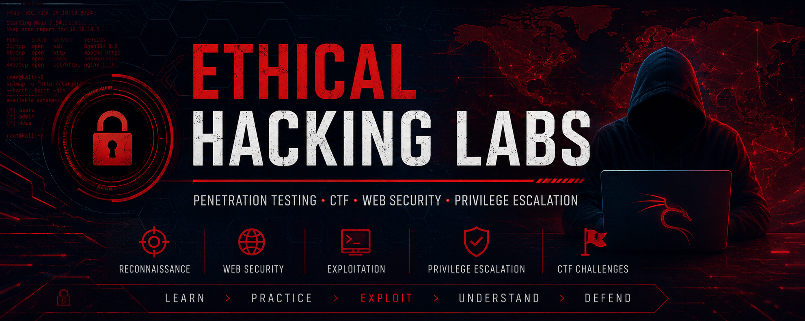

<p align="center">
  
</p>

# 🔴 Ethical Hacking Labs

> Practical penetration testing, Capture The Flag (CTF) challenges and offensive cybersecurity laboratories performed in controlled environments.

This repository documents my practical learning journey in **offensive cybersecurity**, including **Capture The Flag (CTF) challenges**, **penetration testing exercises**, **vulnerability assessments**, and **technical security reports**.

All activities have been performed exclusively in **authorized laboratory environments** for educational purposes.

---

# 🎯 Objectives

This repository aims to:

- Develop practical penetration testing skills.
- Learn offensive security methodologies.
- Improve technical documentation.
- Practice vulnerability identification and exploitation.
- Produce professional technical reports.
- Build a cybersecurity portfolio.

---

# 🛠 Areas Covered

## 🔍 Reconnaissance

- Information Gathering
- OSINT
- Enumeration
- Service Discovery

---

## 🌐 Web Application Security

- SQL Injection
- XSS
- Authentication
- File Upload
- Command Injection
- OWASP Top 10

---

## 💻 Linux Privilege Escalation

- Enumeration
- Misconfigurations
- SUID
- Capabilities
- Cron Jobs

---

## 🪟 Windows Privilege Escalation

- Services
- Registry
- Scheduled Tasks
- Credentials

---

## 🚩 Capture The Flag (CTF)

Practical machines solved during cybersecurity training.

Each report includes:

- Objective
- Enumeration
- Exploitation
- Privilege Escalation
- Flags
- Lessons Learned

---

## 📄 Technical Reports

Professional documentation including:

- Executive Summary
- Technical Findings
- Risk Assessment
- Evidence
- Recommendations

---

# 📂 Repository Structure

```text
Ciberseguridad_y_hacking_etico
│
├── README.md
├── assets/
│
├── CTF_reports/
│
├── Pentesting/
│
├── Web_Security/
│
├── Linux_Privilege_Escalation/
│
├── Windows_Privilege_Escalation/
│
├── Reports/
│
└── Resources/
```

---

# ⚠️ Ethical Notice

All exercises contained in this repository were performed in **authorized laboratory environments**, virtual machines or Capture The Flag platforms.

This repository is intended exclusively for **educational and defensive cybersecurity purposes**.

---

# 🚧 Current Status

This repository is continuously updated with new laboratories, reports and offensive security exercises.

---

# 📚 Skills Demonstrated

- Vulnerability Assessment
- Web Application Testing
- Network Enumeration
- Linux Administration
- Privilege Escalation
- Technical Documentation
- Report Writing
- Security Analysis

---

# 👨‍💻 Author

**Jesús Díaz**

Junior Cybersecurity Analyst

- 💼 LinkedIn: https://www.linkedin.com/in/jesus-diaz-exposito
- 🌐 Portfolio: https://jediex69.github.io
- 🐙 GitHub: https://github.com/Jediex69

---

> *"Understanding how attacks work is essential to building stronger defenses."*
